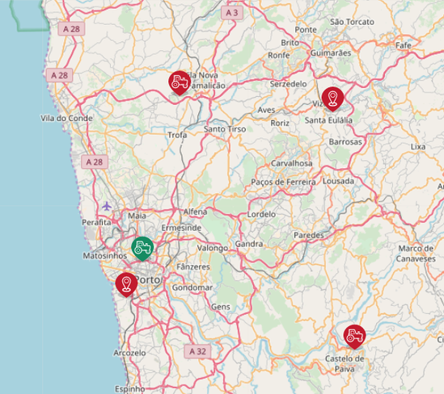

title: Assemblea de Katuma
layout: true

---

class: impact

# {{title}}
30 de maig de 2018

---

class: impact

## Introducció

---

### Tasques des de la darrera assemblea

--
* Petites passes en la traducció al català

--
* Participació a projectes Singulars

--
* Col·laboració amb el districte de l'Eixample

--
* Millora de www.katuma.org

---

### Xifres d'ús

---

### Estat d'Open Food Network

---

### Relació amb Katuma Portugal

* Compartim infraestructura
* Proves pilot amb AMAPs de Porto
* Indaguen la seva futura estructura formal
* Aporten desenvolupadors a Open Food Network

.right.pull-right[]

---

class: impact

## Resultats del matchfunding

---

class: middle

.big[9.711€ recaptats durant 80 dies!]

---

class: impact

# Felicitem-nos! 🎉

---

class: impact

## Pla de viabilitat

---

class: impact

## Proposta d’estatuts

---

class: impact

## Consell rector

