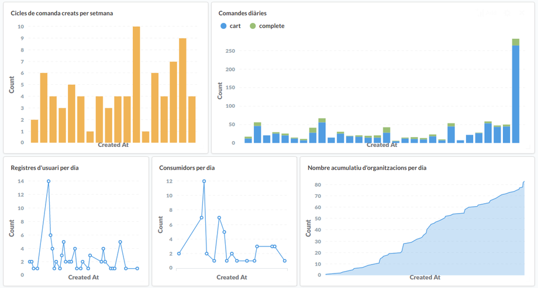
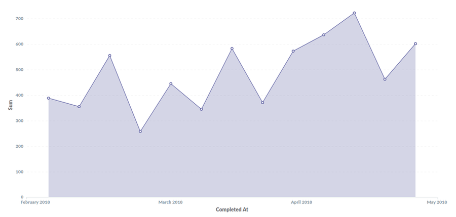
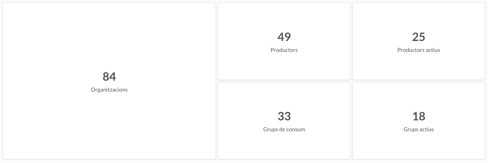
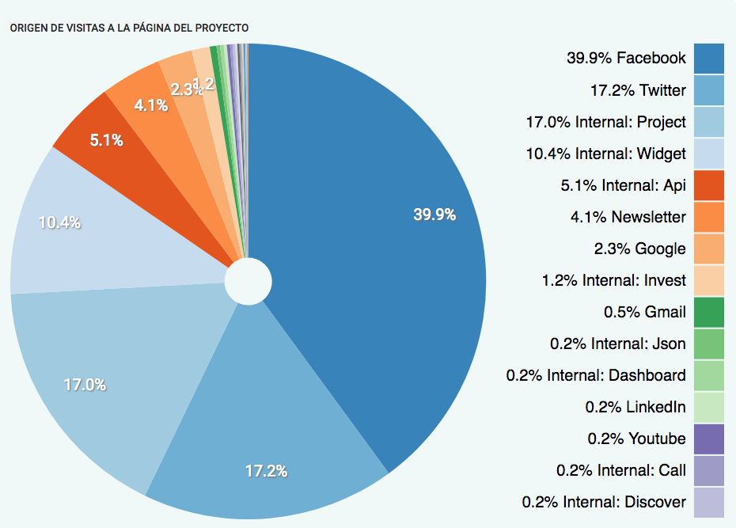
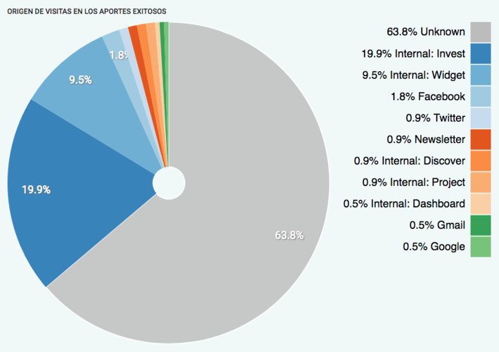

title: Assemblea de Katuma
layout: true

---

class: impact

# {{title}}
30 de maig de 2018

---

class: impact

background-image: radial-gradient(rgba(58, 64, 122, 0.75), rgba(58, 64, 122, 0.85)), url(images/door.jpg)

## Introducció

---

### Tasques des de la darrera assemblea

???
* Full de ruta gira al voltant de la implicació de la comunitat, el projecte empresarial i enllestir el producte mínim viable.
* L'eix el primer trimestre ha estat la comunitat.

--
* Full de ruta 2018

--
* Tasques de comunicació

--
* Contacte amb actores del sector

--
* Acompanyament a grups i productors

--
* Petites passes en la traducció al català

???
* Nosaltres anem desbordats i el temps per traduir és temps que treiem d'altres coses.
* Hem contactat un parell de persones però s'hi ha d'estar a sobre.

--
* Acompanyament des del Cercle de Consum

???
* Es tracta d'un projecte Singular en el marc del Cercle de Consum de Coòpolis
* Hem redactat un dossier d'eines TIC per a grups i fem tallers

--
* Millora de www.katuma.org

???
* Necessari per fer comunicació en motiu del matchfunding
* Ens ha servit d'excusa per millorar-ne l'efectivitat i estil

--
* Col·laboració amb el districte de l'Eixample

???
* Només parlant-ne: 3 tallers/jornades a grups
* Hem passat pressupost orientatiu. Inclou impressió material
* Una altra excusa per pagar material gràfic

---

### Malauradament...

* ~~Grups de treball més enllà del Matchfunding~~
* ~~Llistes de correu~~

---

class: middle

.big[més de 120h dedicades]

---

### Xifres d'ús

.center[]

---

Volum de comandes setmanals 
.bold[.huge[484.42€]]

---

### Xifres d'ús

.center[]

---

#### Productors en ús

* Cooperativa de Consum El Cabàs (Ca la Sisqueta)
* Faves Comptades
* Grup de consum La Panarra
* Panxacontenta
* Grup de Consum El Cabàs (Ateneu)
* Ridorta.Grup de consum ecològic d'Horta
* La bastida
* A Gradicela
* R.C.V. Central de Abastecimiento
* Horta da Partilha

---

#### Grups en ús

* L'Estol ecològic
* Pagerols agricultura b.i.o...agradable
* Conreu Sereny
* L'Aresta Cooperativa
* A Gradicela
* Arqueixal
* Horta da Partilha
* R.C.V. Central de Abastecimiento

---

### Estat d'Open Food Network

--
* Únic equip de desenvolupament

--
* Millora en l'organització de la feina

--
* Versió nova cada dues setmanes

--
* Estandarització de la infraestructura

--
* Sessions de treball de futures funcionalitats

--
* OFN Estats Units i OFN Alemanya iniciant-se

--
* Contactes amb possibles OFN Bèlgica i OFN Itàlia

---

class: middle

Fons 2018 
.bold[.huge[169.466€]]

---

class: middle

.col-3[
França 
.bold[.huge[101.918€]]
]

.col-9[
Canadà 
.bold[.huge[10.600€]]
]

.col-3[
Regne Unit 
.bold[.huge[8.173€]]
]

.col-6[
Austràlia 
.bold[.huge[4.140€]]
]

---

### Relació amb Katuma Portugal

.col-6[
* Compartim infraestructura
* Proves pilot amb AMAPs de Porto
* Indaguen la seva futura estructura formal
* Aporten desenvolupadors a Open Food Network
]

---

class: impact

background-image: radial-gradient(rgba(58, 64, 122, 0.75), rgba(58, 64, 122, 0.85)), url(images/cash_register.jpg)

## Resultats del matchfunding

---

class: middle

.big[114 cofinançadors] 
.big[26 han renunciat a recompensa] 
.big[9 dies en arribar al mínim]

---

class: middle

.huge[9.711€* recaptats durant 80 dies!]

7.924,72€ de benefici

---

class: impact

background-image: radial-gradient(rgba(58, 64, 122, 0.75), rgba(58, 64, 122, 0.85)), url(images/confeti.jpg)

# Felicitem-nos!

---

## Dades

.center[]

---

## Dades

.center[]

---

class: impact

background-image: radial-gradient(rgba(58, 64, 122, 0.75), rgba(58, 64, 122, 0.85)), url(images/runway.jpg)

## Fundació de Katuma SCCL

---

class: middle

.big[Acompanyament del **Cercle de Consum** i el projecte singular **Mercat Cooperatiu Ecològic**]

---

### Pla de viabilitat

Explicació

---

### Pla de viabilitat

Debat

---

### Proposta d’estatuts

Explicació

---

### Proposta d’estatuts

Debat

---

### Consell rector

Explicació

---

### Consell rector

Format per entitats sòcies

* President
* Secretari

---

### Consell rector

Propostes

---

class: impact

background-image: radial-gradient(rgba(58, 64, 122, 0.75), rgba(58, 64, 122, 0.85)), url(images/plates.jpg)

## Preguntes

---
